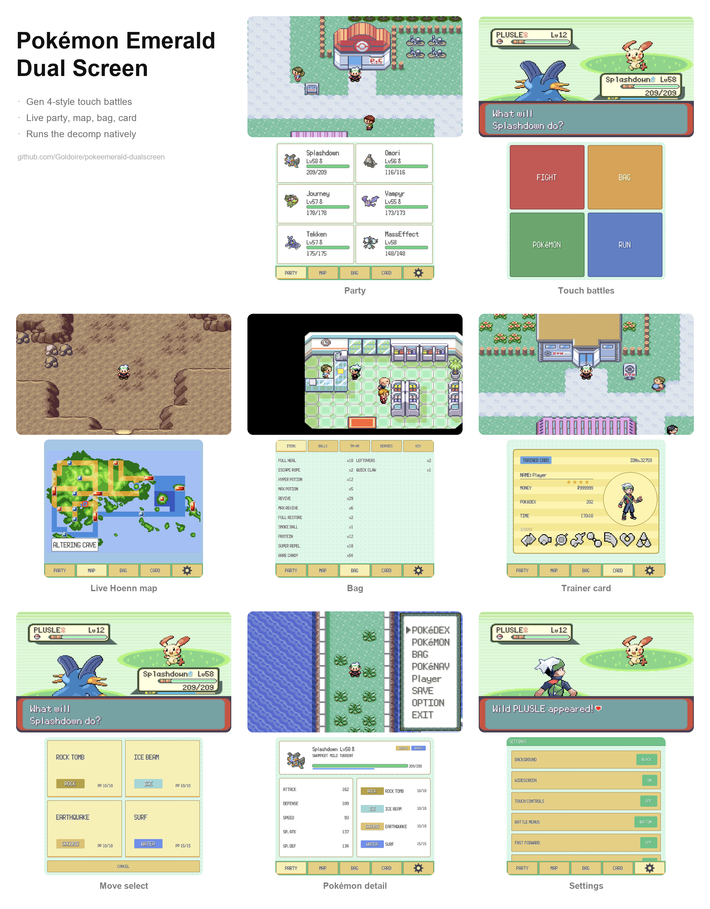

# Pokémon Emerald Dual Screen

A dual-screen mod of the [Pokémon Emerald decompilation](https://github.com/pret/pokeemerald) for the AYN Thor and other dual-screen Android devices. The game runs natively, no emulator involved. 

No ROM or copyrighted assets are included. Provide your own rom to get the game up and running.  
  
As a result, currently no ROM hacks are supported. This is meant to be a vanilla dual screen experience at the moment, with more support coming soon.

## Instructions

1. Install the APK from the [releases page](https://github.com/Goldoire/pokeemerald-dualscreen/releases).
  Android will warn about an unknown developer.
2. Launch the app and tap "Select ROM" when asked, then pick your
  Pokémon Emerald (USA/Europe) ROM. It is checked against SHA-1
   `f3ae088181bf583e55daf962a92bb46f4f1d07b7`.
   (You can also drop the ROM at `Android/data/com.pokeemerald.dualscreen/files/baserom.gba`
   beforehand to skip the picker.)
3. That's it. The app restores the game data once and boots straight into
  the game. Future launches skip this step

## Saves

You can bring an existing save with you. Any ordinary 128 KB GBA flash save, the same file an emulator or a cart dumper writes, n can be put at `Android/data/com.pokeemerald.dualscreen/files/pokeemerald.sav`. 

Copy yours there and it loads on the next launch, or copy it out to transfer your save elsewhere. This doesn't include savestates or other formats.

## Features

- **Native widescreen!** 16:9 Widescreen for the top screen, without stretching the image
- **Fast forward:** without speeding up the music, at 2x, 3x, and 4x
- **Party**: icons, HP and status for all six. Tap a Pokémon for its
stats, nature, ability, moves and exp.
- **Gen 4 style battles**: use touch/controls on the bottom screen to select between options and moves.
- **Battle hints** (off by default): effectiveness carets on each move
and the foe's weaknesses on its card.
- **Map**: the Hoenn Pokénav map with your live position and the name of
where you are.
- **Bag**: all five pockets with live quantities.
- **Trainer card**: badges, money, playtime, based on the in-game card

## Credits

- [pret/pokeemerald](https://github.com/pret/pokeemerald): the decompilation
this is built on.
- [gradenGnostic/pokeemerald-multiplatform](https://github.com/gradenGnostic/pokeemerald-multiplatform):
the native SDL2 port.
- [samyost1/tmc-android](https://github.com/samyost1/tmc-android) and
[samyost1/zelda3-android](https://github.com/samyost1/zelda3-android):
the dual-screen blueprint this follows.

The dual-screen mod was made with the help of Claude Code and other AI
coding tools.

## Legal

This project is a fan work. It is **not affiliated with, endorsed by, or
associated with** Nintendo, Creatures Inc. or GAME FREAK inc. Pokémon, Pokémon
character names, and Pokémon Emerald are trademarks of those companies.

This repository is built on a **decompilation** of Pokémon Emerald, and it
therefore contains assets derived from that game — graphics, palettes, music as
MIDI, instrument samples, text and map data — inherited from the upstream
[pret/pokeemerald](https://github.com/pret/pokeemerald) decompilation. Those
assets remain the property of their respective owners and are **not** covered by
this project's licence; see [LICENSE](LICENSE), which grants rights only over
the port modifications themselves.

**No ROM is distributed here.** The game ROM and the GBA BIOS are excluded from
version control, and you must supply your own legally obtained copy of Pokémon
Emerald to build or play. Release builds are gated on a SHA-1 check of that ROM
and have the corresponding data removed from the executable, so a distributable
build carries no game data of its own.