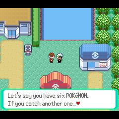

# Emerald Nano

Pokémon Emerald running **natively** on the [Anbernic RG Nano](https://anbernic.com) —
no emulator. A software GBA renderer drives the 1.54" 240×240 screen on a
single-core Allwinner V3s with 64 MB of RAM, at the GBA's authentic 59.7275 Hz.

| 2× zoom | 1:1 |
|---|---|
|  |  |

*Same conversation in both, straight off the device's framebuffer at its real
240×240. These are the [experimental full-screen build](experiments/fullscreen240/);
the default build is described below.*

**No ROM is included.** You supply your own legally obtained copy — see
[Legal](#legal).

## Two layouts

**Default — game plus companion panel.** The 240×160 GBA screen sits at the top
of the panel, with a 240×80 companion strip below it that follows what is
happening in game: your party with HP and status, the Poké​nav map with your live
position, your bag, and a mirrored action/move grid during battles. **L** and
**R** cycle it.

**Experimental — the whole screen is the game.**
[`experiments/fullscreen240/`](experiments/fullscreen240/) drops the companion
panel and fills all 240×240 with the field:

- **2×** magnifies the field to fill the panel — uniform pixels, no stretching —
  while the dialogue box and menus are drawn *unscaled* on top, so nothing is
  clipped by the zoom. Measured at **60 fps** with zero dropped redraws.
- **1:1** shows the game at native scale and reveals 24 rows of extra world above
  and below the GBA's 240×160 viewport; you can see how much further the town
  extends in the right-hand shot above. **48 fps**, with a 16 px bar top and
  bottom.

Both numbers, and the two hard ceilings behind them, are in that directory's
README. It is a separate build (`RG_NANO_FULLSCREEN=1`); the default build is
unaffected.

## Install

There is no prebuilt release yet — build it with the steps below, then:

1. Copy `PokemonEmeraldNano_funkey-s.opk` to **`/mnt/Native games/`** on the
   device.
2. Put your Pokémon Emerald (USA/Europe) ROM at
   **`/mnt/FunKey/.pokemon-emerald-nano/baserom.gba`**. It must be the 16 MiB
   original, checked against SHA-1
   `f3ae088181bf583e55daf962a92bb46f4f1d07b7`.
3. Launch it from the games menu. If the ROM is missing or wrong, the app says
   so on screen rather than failing silently.

## Saves

`/mnt/FunKey/.pokemon-emerald-nano/pokeemerald.sav` — an ordinary 128 KB GBA
flash save, the same file an emulator or a cart dumper writes. Drop yours there
to bring a game across, or copy it out to take one elsewhere. Savestates and
other formats are not supported.

## Controls

| Button | Does |
|---|---|
| D-pad, A, B, START | the GBA buttons |
| **L** / **R** | cycle the companion panel (automatic → party → map → bag) |
| **MENU** | exit prompt — confirm with A, cancel with B |

Emerald barely uses the GBA's shoulder buttons, so L and R drive the panel
instead. In the experimental full-screen build, **X** toggles the layout and
**Y** switches between 2× and 1:1.

## Building

Needs the [FunKey SDK](https://github.com/FunKey-Project/FunKey-OS) (2.3.0) and
a Linux environment — WSL is fine.

```bash
make -f Makefile_rg_nano
BASEROM=/path/to/your/baserom.gba DEVELOPMENT_BUILD=0 scripts/package_rg_nano.sh
```

That produces the OPK in `dist/`. The release build searches your ROM for every
asset it can identify and **removes that data from the executable**, leaving a
manifest of where it came from; the app restores it at launch from the ROM you
supplied. Expect it to take around half an hour. A `DEVELOPMENT_BUILD=1` build
skips all of that and is much faster, but the resulting binary contains the game
data — keep those local.

For the full-screen build, see
[`experiments/fullscreen240/build.sh`](experiments/fullscreen240/build.sh).

[`RG_NANO_PORT_HANDOFF.md`](RG_NANO_PORT_HANDOFF.md) documents the port itself:
the platform layer, the software PPU, the frame budget, and the bugs found on
hardware along the way.

## Also runs on Android


This port descends from
[Goldoire/pokeemerald-dualscreen](https://github.com/Goldoire/pokeemerald-dualscreen),
a dual-screen build for the AYN Thor and other dual-screen Android devices —
also native, also no emulator. Install the APK from
[its releases page](https://github.com/Goldoire/pokeemerald-dualscreen/releases),
then pick your ROM when asked (or drop it at
`Android/data/com.pokeemerald.dualscreen/files/baserom.gba` beforehand). Saves
live alongside it as `pokeemerald.sav`.

That build adds native 16:9 widescreen for the top screen without stretching,
fast-forward at 2×/3×/4× that leaves the music at normal tempo, Gen 4 style
battles driven from the touch screen, optional battle hints, and the party, map,
bag and trainer card views the RG Nano's companion panel is built from.

## Credits

- [pret/pokeemerald](https://github.com/pret/pokeemerald) — the decompilation
  all of this is built on.
- [gradenGnostic/pokeemerald-multiplatform](https://github.com/gradenGnostic/pokeemerald-multiplatform)
  — the native SDL2 port.
- [Goldoire/pokeemerald-dualscreen](https://github.com/Goldoire/pokeemerald-dualscreen)
  — the dual-screen build this RG Nano port descends from, and the source of the
  companion panel and widescreen renderer.
- [samyost1/tmc-android](https://github.com/samyost1/tmc-android) and
  [samyost1/zelda3-android](https://github.com/samyost1/zelda3-android) — the
  dual-screen blueprint that one follows.

Made with the help of Claude Code and other AI coding tools.

## Legal

This project is a fan work. It is **not affiliated with, endorsed by, or
associated with** Nintendo, Creatures Inc. or GAME FREAK inc. Pokémon, Pokémon
character names, and Pokémon Emerald are trademarks of those companies.

This repository is built on a **decompilation** of Pokémon Emerald, and it
therefore contains assets derived from that game — graphics, palettes, music as
MIDI, instrument samples, text and map data — inherited from the upstream
[pret/pokeemerald](https://github.com/pret/pokeemerald) decompilation. Those
assets remain the property of their respective owners and are **not** covered by
this project's licence; see [LICENSE](LICENSE), which grants rights only over
the port modifications themselves.

**No ROM is distributed here.** The game ROM and the GBA BIOS are excluded from
version control, and you must supply your own legally obtained copy of Pokémon
Emerald to build or play. Release builds are gated on a SHA-1 check of that ROM
and have the corresponding data removed from the executable, so a distributable
build carries no game data of its own.
